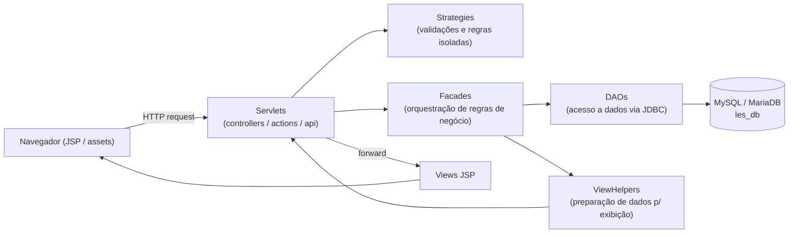

# Trabalho LES - Livraria Online

Sistema web de e-commerce para uma livraria, desenvolvido em **Java EE** (Servlets + JSP), seguindo os padrões **DAO**, **Facade**, **ViewHelper** e **Strategy**. O projeto contempla tanto a loja voltada ao cliente final (front) quanto um painel administrativo completo para gestão de catálogo, estoque, pedidos, fornecedores e usuários.

## Funcionalidades

### Área do cliente (front)
- Cadastro, login e gerenciamento de conta (dados pessoais, senha)
- Busca e busca detalhada de livros
- Carrinho de compras (adicionar, alterar quantidade, remover itens)
- Checkout e finalização de compra
- Cálculo de frete
- Cupons de desconto e cupons de troca
- Acompanhamento de pedidos ("Meus Pedidos") e solicitação de troca
- Recuperação de senha ("Esqueci minha senha")

### Área administrativa
- Login administrativo separado
- Cadastro, edição e listagem de livros e estoque
- Fluxo de ativação/inativação de livros com justificativa e aprovação
- Cadastro e gestão de fornecedores
- Cadastro e gestão de grupos de precificação
- Cadastro e gestão de usuários administradores (com níveis de permissão)
- Gestão de clientes (edição, alteração de status, exclusão)
- Gestão de pedidos (listagem geral e por cliente, detalhes, alteração de status, aprovação/reprovação)
- Gestão de solicitações de troca (aprovação, confirmação de recebimento)
- Cadastro e gestão de cupons de desconto
- Configurações gerais do sistema e geração de gráficos

## Arquitetura

O projeto segue uma arquitetura em camadas típica de aplicações Java EE legadas:

```
src/
├── servlets/       # Controllers (recebem requisições HTTP)
│   ├── actions/    # Servlets que processam ações (submissão de formulários)
│   └── api/        # Endpoints usados via chamadas assíncronas (frete, cupons)
├── facades/        # Fachadas que orquestram DAOs e regras de negócio
├── dao/            # Acesso a dados (JDBC), um DAO por entidade principal
├── strategies/      # Regras de validação e cálculo isoladas (Strategy pattern)
├── viewHelpers/     # Preparação de dados para exibição nas views (JSP)
├── model/           # Entidades de domínio (Livro, Cliente, Pedido, Usuario, etc.)
└── utils/           # Classes utilitárias (conexão com banco, logs, etc.)

WebContent/
├── *.jsp e pastas por módulo (livro, fornecedor, pedido, front, cliente, etc.)
├── WEB-INF/         # web.xml e bibliotecas (JSTL, driver MySQL)
├── assets/          # Recursos estáticos (CSS, JS, imagens)
└── cypress/         # Testes end-to-end
```

**Fluxo típico de requisição:** `Servlet` → `Facade` → `DAO` (+ `Strategy` para validações) → banco de dados; o retorno passa por um `ViewHelper` antes de ser exibido na `JSP`.

### Diagrama de arquitetura



## Tecnologias

- **Java 8** (JDK 1.8)
- **Java EE / Servlets 3.0** + **JSP** (JSTL)
- **Apache Tomcat 7**
- **MySQL** / **MariaDB** como banco de dados
- **Cypress** para testes end-to-end
- Eclipse (projeto configurado com `.project` / `.classpath` para Dynamic Web Project)

## Banco de dados

O schema completo (tabelas, procedures e dados iniciais) está no arquivo `les_db.sql`, com 45 tabelas cobrindo entidades como livros, estoque, pedidos, clientes, usuários administradores, fornecedores, cupons, endereços, entre outras. O dump inclui também procedures armazenadas, como:

- `inativarCarrinhos`: inativa carrinhos abandonados após um período configurável
- `inativarLivros`: inativa livros automaticamente conforme regras de estoque

## Como executar

### Pré-requisitos
- JDK 8
- Apache Tomcat 7 (ou compatível)
- MySQL ou MariaDB
- Eclipse com suporte a Dynamic Web Project (ou outra IDE Java EE equivalente)

### Passos

1. **Banco de dados**: crie um banco chamado `les_db` e importe o arquivo `les_db.sql`.
2. **Configuração de conexão**: em `src/utils/Conexao.java`, ajuste usuário/senha se necessário e escolha entre os métodos `getConnectionMySQL()` (driver `com.mysql.jdbc.Driver`) ou `getConnectionMariaDB()` (driver `org.mariadb.jdbc.Driver`) conforme o banco utilizado. Por padrão, a conexão aponta para `localhost:3306`, usuário `root` e senha em branco.
3. **Importar o projeto**: importe a pasta como *Dynamic Web Project* no Eclipse (os arquivos `.project` e `.classpath` já estão configurados).
4. **Servidor**: configure um servidor Tomcat 7 no Eclipse, adicione o projeto e inicie o servidor.
5. **Acesso**: acesse `http://localhost:8080/trabalho-les/home` para a loja ou `http://localhost:8080/trabalho-les/homeAdmin` para o painel administrativo (após login como usuário admin cadastrado no banco).

### Testes end-to-end

Os testes Cypress estão em `WebContent/cypress`. Para executá-los, é necessário ter Node.js instalado e o Cypress configurado no projeto (arquivo `cypress.json` já presente), apontando para a aplicação em execução.

## Deploy em produção

O projeto gera um artefato `.war` padrão de aplicação Java EE, podendo ser publicado em qualquer servidor compatível com Servlet 3.0 (Tomcat 7+, Jetty, etc.). Passos gerais:

1. **Gerar o WAR**
   - Pelo Eclipse: clique com o botão direito no projeto → `Export` → `WAR File`, selecione o destino e gere o arquivo (ex.: `trabalho-les.war`).
   - Via linha de comando, empacotando manualmente o conteúdo de `WebContent` (incluindo `WEB-INF/classes` com as classes compiladas) em um `.war`.

2. **Provisionar o banco de dados**
   - Suba uma instância MySQL/MariaDB no ambiente de produção.
   - Importe o schema com `mysql -u <usuario> -p les_db < les_db.sql` (ou equivalente no MariaDB).
   - Crie um usuário de banco dedicado (evite usar `root`) e restrinja privilégios ao necessário.

3. **Ajustar a conexão com o banco**
   - Atualize `src/utils/Conexao.java` (ou externalize as credenciais, se for evoluir o projeto) para apontar para o host, usuário e senha do banco de produção, em vez dos valores padrão de desenvolvimento (`localhost`, `root`, senha em branco).
   - Recompile o projeto após a alteração.

4. **Configurar o servidor de aplicação**
   - Instale o Tomcat 7+ (ou versão compatível) no servidor de produção.
   - Copie o driver JDBC (`mysql-connector-java-*.jar`, já presente em `WEB-INF/lib`). Além disso, verifique se a versão é compatível com a versão do banco em produção.
   - Ajuste memória/heap da JVM conforme a carga esperada (`-Xms` / `-Xmx`).

5. **Publicar a aplicação**
   - Copie o `.war` gerado para a pasta `webapps/` do Tomcat (deploy automático) ou publique via o *Tomcat Manager*.
   - Verifique os logs do Tomcat (`logs/catalina.out`) e o log de atividades da aplicação (`logs/logAtividades.txt`) para confirmar que a inicialização ocorreu sem erros.

6. **Itens recomendados antes de ir para produção**
   - Trocar credenciais padrão (usuário `root` sem senha) por credenciais fortes e específicas do ambiente.
   - Configurar HTTPS (via proxy reverso como Nginx/Apache ou diretamente no conector do Tomcat).
   - Revisar o agendamento das *stored procedures* (`inativarCarrinhos`, `inativarLivros`). Em produção, elas normalmente devem ser executadas por um job/scheduler do próprio banco (event scheduler do MySQL/MariaDB) ou por uma tarefa externa (cron).
   - Definir rotação/monitoramento do arquivo `logs/logAtividades.txt`, que cresce indefinidamente.

> **Observação:** por se tratar de um projeto acadêmico, não há um pipeline de CI/CD nem arquivos de configuração de ambiente (`.env`, profiles de produção) prontos. Os passos acima descrevem o caminho manual equivalente ao que a estrutura atual do projeto permite.

## Estrutura de logs

O sistema registra atividades em `logs/logAtividades.txt`, através da classe utilitária `utils/Log.java`.

## Observações

Este é um projeto acadêmico (disciplina "LES"), com foco em boas práticas de arquitetura em camadas, padrões de projeto (DAO, Facade, Strategy) e testes automatizados de ponta a ponta.
